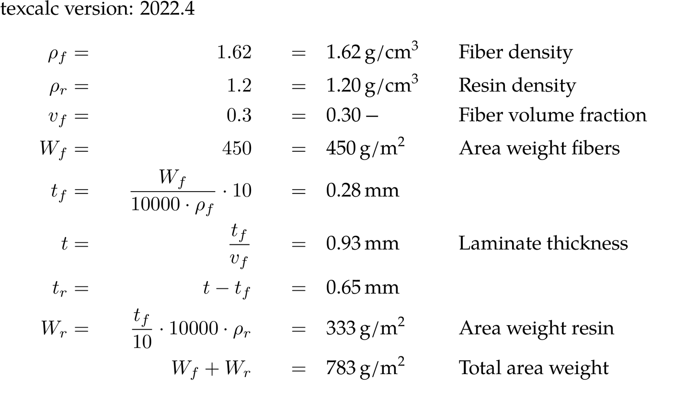

the TeXcalc module
##################

As an engineer, I often do diverse calculations that I want to save in my
logbooks which I write in LaTeX.  Up to now I've either formatted those by
hand or used the ``listings`` package to include calculations made in IPython.

These techniques are not optimal.  Formatting by hand makes it time consuming
and error-prone to change the typeset calculations; results have to be changed
by hand.  Using the listings package works, but this can only contain the
calculations without explanations or units, and the results aren't always
nicely formatted. Technical calculations without units are generally
meaningless, so it was important for me to be able to include them in the
results.

So I wrote a Python module called ``texcalc`` that allows me to do
calculations and typesets the results for me. It works like this;

.. code-block:: python

    from texcalc import Calculation

    c = Calculation()
    c.add('rho_f', '1.62', 'g/cm^3', 'Fiber density')
    c.add('rho_r', '1.2', 'g/cm^3', "Resin density")
    c.add('v_f', '0.3', '-', 'Fiber volume fraction')
    c.add('W_f', '450', 'g/m^2', "Area weight fibers", fmt=".0f")
    c.add('t_f', 'W_f/(10000*rho_f)*10', 'mm')
    c.add('t', 't_f/v_f', 'mm', "Laminate thickness")
    c.add('t_r', 't-t_f', 'mm')
    c.add('W_r', 't_f/10*(10000*rho_r)', 'g/m^2', "Area weight resin", fmt=".0f")
    print(c)

Using a ``Calculation`` object one can define a sequence of variable
assignments or expressions using variables that have been assigned earlier.
Printing the ``Calculation`` (or rather converting it to a string) will cause
a LaTeX formatted version in the form of an array_ environment to be produced.
When this is written to a file it can be included in a LaTeX document using
``\input``.  The typeset result looks quite nice.

.. _array: http://latex.wikia.com/wiki/Array_%28LaTeX_environment%29

It uses the siunitx_ package to typeset the units of the variables and
calculation results.  It uses ``\mbox`` to include plain text in the otherwise
math-mode ``array`` environment.  This means that the comments should be kept
reasonably short so they fit one one line.  The generated LaTeX code (shown
below) isn't set up to handle comments that would span multiple lines.

.. _siunitx: http://ctan.org/pkg/siunitx

.. code-block:: latex

    \hspace{-\arraycolsep}{$\begin{array}{lclcrl}
    \rho_f & = & & & \mbox{\SI{1.62}{g/cm^3}} & \mbox{Fiber density} \\
    \rho_r & = & & & \mbox{\SI{1.20}{g/cm^3}} & \mbox{Resin density} \\
    v_f & = & & & \mbox{\SI{0.30}{-}} & \mbox{Fiber volume fraction} \\
    W_f & = & & & \mbox{\SI{450}{g/m^2}} & \mbox{Area weight fibers} \\
    t_f & = & \displaystyle \frac{W_f}{10000\cdot \rho_f}\cdot 10 & = & \mbox{\SI{0.28}{mm}} \\ \\[-0.5em]
    t & = & \displaystyle \frac{t_f}{v_f} & = & \mbox{\SI{0.93}{mm}} & \mbox{Laminate thickness} \\ \\[-0.5em]
    t_r & = & \displaystyle t-t_f & = & \mbox{\SI{0.65}{mm}} \\ \\[-0.5em]
    W_r & = & \displaystyle \frac{t_f}{10}\cdot 10000\cdot \rho_r & = & \mbox{\SI{333}{g/m^2}} & \mbox{Area weight resin} \\ \\[-0.5em]
    \end{array}$}\hfill

.. Note::

    This module uses ``eval`` and ``exec``, which exposes the full
    capabilities of the Python interpreter. This module should therefore _not_
    be used with untrusted input!
